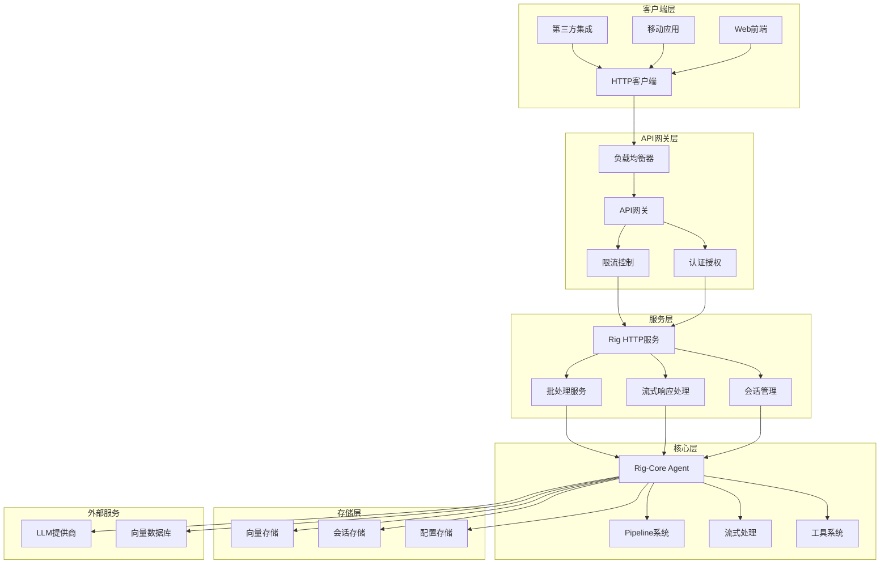

# Rig-Core 对外服务架构设计方案

## 1. 项目概述

### 1.1 当前状态分析

Rig-Core 是一个专注于人体工程学和模块化的 Rust 库，用于构建基于 LLM 的应用程序。通过深入分析代码结构，发现其具有以下特点：

**核心功能模块：**
- **Agent系统**：提供高级LLM抽象，支持多轮对话、工具调用、RAG等
- **Pipeline系统**：灵活的管道API，支持操作链式组合
- **流式处理**：完整的流式响应支持，包括暂停/恢复控制
- **多提供商支持**：20+模型提供商，10+向量存储集成
- **CLI聊天机器人**：目前主要通过CLI接口进行交互

**当前限制：**
- 主要面向本地使用，通过`println!`输出结果
- 缺乏HTTP API或Web服务接口
- 没有对外服务的基础设施

### 1.2 改进目标

将rig-core从本地打印工具转变为可对外提供服务的完整平台，支持：
- HTTP API接口
- WebSocket实时通信
- 会话管理
- 企业级功能（认证、限流、监控）
- 高并发和高可用性

## 2. 整体架构设计



## 3. 核心服务架构

### 3.1 HTTP服务模块设计

```rust
// 新增模块：rig-core/src/server/mod.rs
pub mod http;
pub mod websocket;
pub mod middleware;
pub mod handlers;
pub mod session;
pub mod config;

// HTTP服务核心结构
pub struct RigHttpServer {
    agent_registry: AgentRegistry,
    session_manager: SessionManager,
    config: ServerConfig,
    middleware_stack: MiddlewareStack,
}

// 会话管理
pub struct SessionManager {
    sessions: Arc<RwLock<HashMap<String, Session>>>,
    cleanup_task: JoinHandle<()>,
}

// 配置管理
pub struct ServerConfig {
    pub host: String,
    pub port: u16,
    pub max_sessions: usize,
    pub session_timeout: Duration,
    pub rate_limit: RateLimitConfig,
}
```

### 3.2 API接口设计

```rust
// RESTful API端点
pub enum ApiEndpoint {
    // 聊天相关
    Chat,
    ChatStream,
    ChatHistory,
    
    // 代理管理
    AgentCreate,
    AgentList,
    AgentUpdate,
    AgentDelete,
    
    // 工具管理
    ToolList,
    ToolExecute,
    
    // 向量存储
    VectorSearch,
    VectorIndex,
    
    // 系统管理
    Health,
    Metrics,
    Config,
}

// 请求/响应结构
#[derive(Serialize, Deserialize)]
pub struct ChatRequest {
    pub message: String,
    pub session_id: Option<String>,
    pub stream: bool,
    pub context: Option<ChatContext>,
}

#[derive(Serialize, Deserialize)]
pub struct ChatResponse {
    pub response: String,
    pub session_id: String,
    pub usage: Option<Usage>,
    pub metadata: ResponseMetadata,
}
```

## 4. 流式响应处理

### 4.1 WebSocket支持

```rust
// WebSocket连接管理
pub struct WebSocketManager {
    connections: Arc<RwLock<HashMap<String, WebSocketConnection>>>,
    broadcast_tx: broadcast::Sender<BroadcastMessage>,
}

// 流式响应适配器
pub struct StreamingResponseAdapter {
    agent: Arc<dyn AgentTrait>,
    session_manager: Arc<SessionManager>,
}

impl StreamingResponseAdapter {
    pub async fn handle_streaming_chat(
        &self,
        request: ChatRequest,
        ws_connection: WebSocketConnection,
    ) -> Result<(), ServerError> {
        let mut response_stream = self.agent
            .stream_prompt(&request.message)
            .with_session(request.session_id)
            .await?;

        while let Some(chunk) = response_stream.next().await {
            let message = WebSocketMessage::from(chunk);
            ws_connection.send(message).await?;
        }
        
        Ok(())
    }
}
```

### 4.2 Server-Sent Events (SSE) 支持

```rust
// SSE响应处理
pub async fn handle_sse_chat(
    request: ChatRequest,
    response: Response,
) -> Result<Response, ServerError> {
    let stream = self.agent
        .stream_prompt(&request.message)
        .await?;

    let sse_stream = stream.map(|chunk| {
        let event = format!("data: {}\n\n", serde_json::to_string(&chunk)?);
        Ok::<_, ServerError>(event)
    });

    Ok(Response::builder()
        .header("Content-Type", "text/event-stream")
        .header("Cache-Control", "no-cache")
        .header("Connection", "keep-alive")
        .body(Body::from_stream(sse_stream))?)
}
```

## 5. 会话管理系统

```rust
// 会话结构
pub struct Session {
    pub id: String,
    pub created_at: Instant,
    pub last_activity: Instant,
    pub history: Vec<Message>,
    pub context: SessionContext,
    pub agent_config: AgentConfig,
}

// 会话管理器
impl SessionManager {
    pub async fn create_session(&self, config: SessionConfig) -> Result<String, SessionError> {
        let session_id = Uuid::new_v4().to_string();
        let session = Session {
            id: session_id.clone(),
            created_at: Instant::now(),
            last_activity: Instant::now(),
            history: Vec::new(),
            context: config.context,
            agent_config: config.agent_config,
        };
        
        self.sessions.write().await.insert(session_id.clone(), session);
        Ok(session_id)
    }
    
    pub async fn get_session(&self, id: &str) -> Option<Session> {
        self.sessions.read().await.get(id).cloned()
    }
    
    pub async fn update_session(&self, id: &str, update: SessionUpdate) -> Result<(), SessionError> {
        if let Some(session) = self.sessions.write().await.get_mut(id) {
            session.last_activity = Instant::now();
            update.apply(session);
            Ok(())
        } else {
            Err(SessionError::NotFound)
        }
    }
}
```

## 6. 中间件系统

```rust
// 中间件trait
pub trait Middleware: Send + Sync {
    async fn handle(&self, request: &mut Request, next: Next) -> Result<Response, ServerError>;
}

// 认证中间件
pub struct AuthMiddleware {
    jwt_secret: String,
}

impl Middleware for AuthMiddleware {
    async fn handle(&self, request: &mut Request, next: Next) -> Result<Response, ServerError> {
        let token = extract_token(request)?;
        let claims = validate_token(&token, &self.jwt_secret)?;
        request.extensions_mut().insert(claims);
        next.run(request).await
    }
}

// 限流中间件
pub struct RateLimitMiddleware {
    limiter: Arc<RateLimiter>,
}

impl Middleware for RateLimitMiddleware {
    async fn handle(&self, request: &mut Request, next: Next) -> Result<Response, ServerError> {
        let client_id = extract_client_id(request)?;
        if self.limiter.is_allowed(&client_id).await {
            next.run(request).await
        } else {
            Err(ServerError::RateLimited)
        }
    }
}
```

## 7. 配置和部署

### 7.1 配置文件结构

```toml
# rig-server.toml
[server]
host = "0.0.0.0"
port = 8080
max_connections = 1000
request_timeout = "30s"

[agent]
default_model = "gpt-4"
max_tokens = 4096
temperature = 0.7

[session]
max_sessions = 10000
session_timeout = "1h"
cleanup_interval = "5m"

[rate_limit]
requests_per_minute = 60
burst_size = 10

[security]
jwt_secret = "your-secret-key"
cors_origins = ["http://localhost:3000"]

[logging]
level = "info"
format = "json"
```

## 8. 监控和可观测性

```rust
// 指标收集
pub struct MetricsCollector {
    request_counter: Counter,
    response_time_histogram: Histogram,
    active_sessions_gauge: Gauge,
    error_counter: Counter,
}

// 健康检查
pub async fn health_check() -> Result<Response, ServerError> {
    let health = HealthStatus {
        status: "healthy",
        timestamp: Utc::now(),
        version: env!("CARGO_PKG_VERSION"),
        uptime: get_uptime(),
        dependencies: check_dependencies().await,
    };
    
    Ok(Response::json(health))
}
```

## 9. 实现步骤

### 阶段1：基础HTTP服务
1. 创建HTTP服务器框架
2. 实现基本的REST API端点
3. 添加会话管理
4. 集成现有的Agent系统

### 阶段2：流式响应
1. 实现WebSocket支持
2. 添加SSE支持
3. 优化流式响应性能
4. 添加流控制功能

### 阶段3：高级功能
1. 实现中间件系统
2. 添加认证和授权
3. 实现限流和监控
4. 添加配置管理

### 阶段4：生产就绪
1. 添加日志和监控
2. 实现健康检查
3. 优化性能和内存使用
4. 添加部署和运维工具

## 10. 使用示例

### 10.1 启动服务器

```rust
// 启动服务器
#[tokio::main]
async fn main() -> Result<(), Box<dyn std::error::Error>> {
    let config = ServerConfig::from_file("rig-server.toml")?;
    let server = RigHttpServer::new(config).await?;
    server.start().await?;
    Ok(())
}
```

### 10.2 客户端使用示例

```rust
// 基础聊天
let client = RigClient::new("http://localhost:8080")?;
let response = client.chat("Hello, world!").await?;
println!("Response: {}", response.message);

// 流式聊天
let mut stream = client.chat_stream("Tell me a story").await?;
while let Some(chunk) = stream.next().await {
    print!("{}", chunk.text);
}

// 会话管理
let session_id = client.create_session().await?;
let response = client.chat_with_session("Hello", &session_id).await?;
```

### 10.3 WebSocket客户端

```javascript
// JavaScript WebSocket客户端
const ws = new WebSocket('ws://localhost:8080/chat/stream');

ws.onopen = function() {
    ws.send(JSON.stringify({
        message: "Hello, world!",
        session_id: "optional-session-id"
    }));
};

ws.onmessage = function(event) {
    const data = JSON.parse(event.data);
    console.log('Received:', data.text);
};
```

## 11. API接口规范

### 11.1 REST API端点

| 方法 | 路径 | 描述 |
|------|------|------|
| POST | `/api/v1/chat` | 发送聊天消息 |
| GET | `/api/v1/chat/stream` | 流式聊天（SSE） |
| GET | `/api/v1/sessions` | 获取会话列表 |
| POST | `/api/v1/sessions` | 创建新会话 |
| GET | `/api/v1/sessions/{id}` | 获取会话详情 |
| DELETE | `/api/v1/sessions/{id}` | 删除会话 |
| GET | `/api/v1/agents` | 获取代理列表 |
| POST | `/api/v1/agents` | 创建代理 |
| GET | `/api/v1/health` | 健康检查 |
| GET | `/api/v1/metrics` | 获取指标 |

### 11.2 WebSocket端点

| 路径 | 描述 |
|------|------|
| `/ws/chat/stream` | 流式聊天WebSocket |
| `/ws/chat/session/{id}` | 会话特定聊天WebSocket |

## 12. 性能优化

### 12.1 连接池管理
- 实现LLM提供商连接池
- 向量存储连接复用
- 数据库连接池优化

### 12.2 缓存策略
- 响应缓存
- 会话状态缓存
- 向量索引缓存

### 12.3 异步处理
- 非阻塞I/O
- 并发请求处理
- 流式响应优化

## 13. 安全考虑

### 13.1 认证和授权
- JWT令牌认证
- API密钥管理
- 角色基础访问控制

### 13.2 数据安全
- 请求/响应加密
- 敏感数据脱敏
- 审计日志

### 13.3 防护措施
- 速率限制
- 输入验证
- SQL注入防护

## 14. 总结

这个设计方案将rig-core从一个优秀的LLM应用开发库转变为一个完整的AI服务平台，主要优势包括：

### 技术优势：
- **保持现有架构**：充分利用rig-core现有的Agent、Pipeline、流式处理等核心功能
- **渐进式改进**：可以分阶段实现，不影响现有功能
- **高性能**：基于Rust的异步架构，支持高并发
- **可扩展性**：模块化设计，易于扩展和维护

### 业务价值：
- **服务化**：从库转变为服务，支持多客户端接入
- **企业级**：提供认证、监控、限流等企业级功能
- **实时性**：支持WebSocket和SSE，提供实时交互体验
- **可观测性**：完整的监控和日志系统，便于运维

通过这个设计方案，rig-core将能够支持各种客户端应用和第三方集成，成为一个功能完整的AI服务平台。
