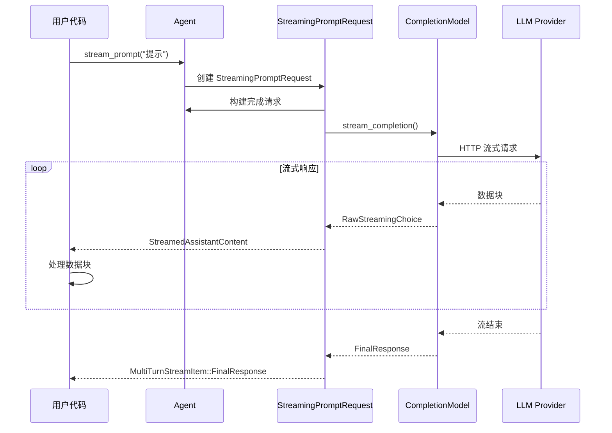
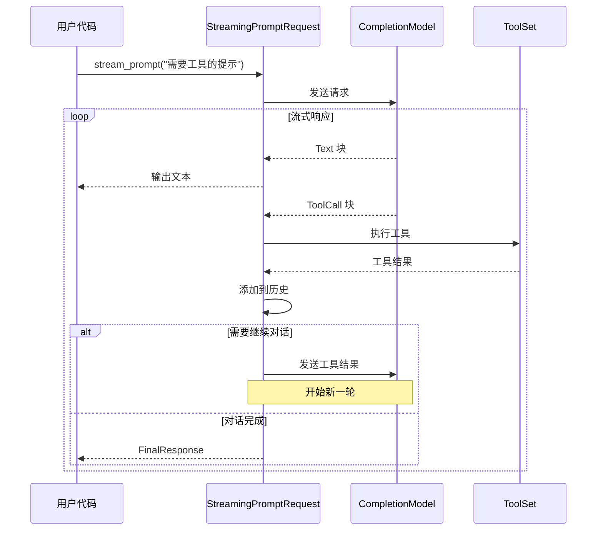

# Rig 项目流式处理架构文档

## 概述

Rig 项目实现了完整的 LLM 流式处理系统，允许实时接收和处理来自大语言模型的响应。流式处理是现代 AI 应用的关键特性，它可以：

- 提供更好的用户体验（实时反馈）
- 减少首字节时间（TTFB）
- 支持长时间运行的对话
- 实现工具调用的实时处理

## 核心架构

### 1. 流式处理的层次结构

```
用户应用层
    ↓
StreamingPrompt / StreamingChat (高级接口)
    ↓
StreamingCompletion (中级接口)
    ↓
CompletionModel::stream() (底层接口)
    ↓
Provider 实现 (Ollama, OpenAI, etc.)
    ↓
HTTP 流式响应
```

### 2. 核心组件

#### 2.1 StreamingPrompt Trait

**位置**: `rig-core/src/streaming.rs`

**作用**: 定义高级流式提示接口

```rust
pub trait StreamingPrompt<M, R>
where
    M: CompletionModel + 'static,
    R: GetTokenUsage + Clone + Unpin,
{
    /// 发起流式提示请求
    fn stream_prompt(&self, prompt: impl Into<Message> + Send) 
        -> StreamingPromptRequest<M, ()>;
}
```

**特点**:
- 最简单的流式接口
- 单次提示，实时响应
- 返回 `StreamingPromptRequest` 构建器

#### 2.2 StreamingChat Trait

**位置**: `rig-core/src/streaming.rs`

**作用**: 定义带历史记录的流式聊天接口

```rust
pub trait StreamingChat<M, R>
where
    M: CompletionModel + 'static,
    R: GetTokenUsage + Clone + Unpin,
{
    /// 发起带历史的流式聊天请求
    fn stream_chat(
        &self,
        prompt: impl Into<Message> + Send,
        chat_history: Vec<Message>,
    ) -> StreamingPromptRequest<M, ()>;
}
```

**特点**:
- 支持对话历史
- 上下文感知
- 适合多轮对话

#### 2.3 StreamingCompletion Trait

**位置**: `rig-core/src/streaming.rs`

**作用**: 定义底层流式完成接口

```rust
pub trait StreamingCompletion<M: CompletionModel> {
    /// 生成流式完成请求构建器
    async fn stream_completion(
        &self,
        prompt: impl Into<Message> + Send,
        chat_history: Vec<Message>,
    ) -> Result<CompletionRequestBuilder<M>, CompletionError>;
}
```

**特点**:
- 提供更细粒度的控制
- 返回请求构建器，可进一步定制
- 与非流式 `Completion` trait 对应

### 3. 流式响应类型

#### 3.1 StreamingCompletionResponse

**位置**: `rig-core/src/streaming.rs`

**核心结构**:
```rust
pub struct StreamingCompletionResponse<R>
where
    R: Clone + Unpin + GetTokenUsage,
{
    // 内部流
    pub(crate) inner: Abortable<StreamingResult<R>>,
    // 中止控制
    pub(crate) abort_handle: AbortHandle,
    // 暂停控制
    pub(crate) pause_control: PauseControl,
    // 累积的文本
    text: String,
    // 推理过程
    reasoning: String,
    // 工具调用
    tool_calls: Vec<ToolCall>,
    // 最终聚合的消息
    pub choice: OneOrMany<AssistantContent>,
    // 原始响应
    pub response: Option<R>,
}
```

**关键功能**:

1. **流式迭代**: 实现 `Stream` trait
   ```rust
   impl<R> Stream for StreamingCompletionResponse<R>
   where
       R: Clone + Unpin + GetTokenUsage,
   {
       type Item = Result<StreamedAssistantContent<R>, CompletionError>;
       
       fn poll_next(self: Pin<&mut Self>, cx: &mut Context<'_>) 
           -> Poll<Option<Self::Item>>;
   }
   ```

2. **暂停/恢复**:
   ```rust
   response.pause();   // 暂停流
   response.resume();  // 恢复流
   ```

3. **取消**:
   ```rust
   response.cancel();  // 中止流
   ```

#### 3.2 RawStreamingChoice

**位置**: `rig-core/src/streaming.rs`

**作用**: 表示流中的单个数据块

```rust
pub enum RawStreamingChoice<R>
where
    R: Clone,
{
    /// 文本块
    Message(String),
    
    /// 工具调用块
    ToolCall {
        id: String,
        call_id: Option<String>,
        name: String,
        arguments: serde_json::Value,
    },
    
    /// 推理块（思考过程）
    Reasoning {
        id: Option<String>,
        reasoning: String,
    },
    
    /// 最终响应对象
    FinalResponse(R),
}
```

#### 3.3 StreamedAssistantContent

**位置**: `rig-core/src/streaming.rs`

**作用**: 表示处理后的流式内容

```rust
pub enum StreamedAssistantContent<R> {
    /// 文本内容
    Text(Text),
    
    /// 工具调用
    ToolCall(ToolCall),
    
    /// 推理过程
    Reasoning(Reasoning),
    
    /// 最终响应
    Final(R),
}
```

### 4. 多轮流式处理

#### 4.1 StreamingPromptRequest

**位置**: `rig-core/src/agent/prompt_request/streaming.rs`

**作用**: 处理多轮对话的流式请求

**核心字段**:
```rust
pub struct StreamingPromptRequest<M, P>
where
    M: CompletionModel + 'static,
    P: StreamingPromptHook<M> + 'static,
{
    agent: Arc<Agent<M>>,
    prompt: Message,
    chat_history: Option<Vec<Message>>,
    max_depth: usize,  // 最大对话轮数
    hook: Option<P>,   // 钩子函数
}
```

**工作流程**:

1. **初始化**: 创建流式请求
2. **循环处理**: 
   - 发送提示到模型
   - 接收流式响应
   - 检测工具调用
   - 执行工具
   - 将结果添加到历史
   - 继续下一轮（如果需要）
3. **深度控制**: 限制对话轮数防止无限循环
4. **钩子回调**: 在关键点触发用户自定义逻辑

#### 4.2 MultiTurnStreamItem

**位置**: `rig-core/src/agent/prompt_request/streaming.rs`

**作用**: 表示多轮对话流中的项

```rust
pub enum MultiTurnStreamItem<R> {
    /// 流式内容块
    StreamItem(StreamedAssistantContent<R>),
    
    /// 最终响应（包含所有轮次的聚合）
    FinalResponse(FinalResponse),
}
```

**FinalResponse 结构**:
```rust
pub struct FinalResponse {
    response: String,           // 完整响应文本
    aggregated_usage: Usage,    // 聚合的 token 使用量
}
```

## 流式处理流程详解

### 流程 1: 基本流式提示



### 流程 2: 带工具调用的流式处理



### 流程 3: 流的内部处理

```rust
// StreamingCompletionResponse 的 poll_next 实现

fn poll_next(self: Pin<&mut Self>, cx: &mut Context<'_>) 
    -> Poll<Option<Self::Item>> 
{
    let stream = self.get_mut();
    
    // 1. 检查暂停状态
    if stream.is_paused() {
        cx.waker().wake_by_ref();
        return Poll::Pending;
    }
    
    // 2. 轮询内部流
    match Pin::new(&mut stream.inner).poll_next(cx) {
        Poll::Pending => Poll::Pending,
        
        Poll::Ready(None) => {
            // 3. 流结束，聚合所有内容
            let mut choice = vec![];
            
            // 添加工具调用
            stream.tool_calls.iter().for_each(|tc| {
                choice.push(AssistantContent::ToolCall(tc.clone()));
            });
            
            // 添加文本内容
            if choice.is_empty() || !stream.text.is_empty() {
                choice.insert(0, AssistantContent::text(stream.text.clone()));
            }
            
            stream.choice = OneOrMany::many(choice).unwrap();
            Poll::Ready(None)
        }
        
        Poll::Ready(Some(Ok(choice))) => {
            // 4. 处理单个数据块
            match choice {
                RawStreamingChoice::Message(text) => {
                    stream.text.push_str(&text);
                    Poll::Ready(Some(Ok(
                        StreamedAssistantContent::Text(Text { text })
                    )))
                }
                RawStreamingChoice::ToolCall { id, name, arguments, .. } => {
                    let tool_call = ToolCall { id, function: ToolFunction { name, arguments } };
                    stream.tool_calls.push(tool_call.clone());
                    Poll::Ready(Some(Ok(
                        StreamedAssistantContent::ToolCall(tool_call)
                    )))
                }
                // ... 其他类型
            }
        }
        
        Poll::Ready(Some(Err(err))) => Poll::Ready(Some(Err(err)))
    }
}
```

## Provider 实现

### Ollama Provider 流式实现

**位置**: `rig-core/src/providers/ollama.rs`

**关键代码**:

```rust
// 1. 发起流式请求
async fn stream(&self, request: CompletionRequest) 
    -> Result<StreamingCompletionResponse<Self::StreamingResponse>, CompletionError> 
{
    let request = self.create_completion_request(request)?;
    let mut request_payload = request;
    request_payload["stream"] = json!(true);  // 启用流式模式
    
    let response = self.client.post("api/chat")?
        .json(&request_payload)
        .send()
        .await?;
    
    if !response.status().is_success() {
        return Err(CompletionError::ProviderError(response.text().await?));
    }
    
    // 2. 创建流式响应
    let stream = self.create_stream(response);
    Ok(StreamingCompletionResponse::stream(stream))
}

// 3. 解析流式数据
fn create_stream(&self, response: reqwest::Response) 
    -> StreamingResult<StreamingCompletionResponse> 
{
    Box::pin(try_stream! {
        let mut stream = response.bytes_stream();
        let mut buffer = String::new();
        
        while let Some(chunk) = stream.next().await {
            let chunk = chunk?;
            buffer.push_str(&String::from_utf8_lossy(&chunk));
            
            // 处理完整的 JSON 行
            while let Some(newline_pos) = buffer.find('\n') {
                let line = buffer[..newline_pos].trim();
                buffer = buffer[newline_pos + 1..].to_string();
                
                if line.is_empty() {
                    continue;
                }
                
                // 解析 JSON 响应
                let response: CompletionResponse = serde_json::from_str(line)?;
                
                // 提取内容
                if let Some(content) = response.message.content {
                    yield RawStreamingChoice::Message(content);
                }
                
                // 检查是否完成
                if response.done {
                    yield RawStreamingChoice::FinalResponse(response);
                    break;
                }
            }
        }
    })
}
```

## 高级特性

### 1. 暂停和恢复控制

**实现**: `PauseControl` 结构体

```rust
pub struct PauseControl {
    paused_tx: watch::Sender<bool>,
    paused_rx: watch::Receiver<bool>,
}

impl PauseControl {
    pub fn pause(&self) {
        self.paused_tx.send(true).unwrap();
    }
    
    pub fn resume(&self) {
        self.paused_tx.send(false).unwrap();
    }
}
```

**使用场景**:
- 用户控制的暂停/恢复
- 速率限制
- 用户确认后继续

**示例**:
```rust
let mut stream = agent.stream_prompt("长文本生成").await;

// 暂停流
stream.pause();

// 用户确认后恢复
stream.resume();

while let Some(chunk) = stream.next().await {
    // 处理数据块
}
```

### 2. 流取消

**实现**: 使用 `AbortHandle`

```rust
impl<R> StreamingCompletionResponse<R> {
    pub fn cancel(&self) {
        self.abort_handle.abort();
    }
}
```

**使用场景**:
- 用户取消请求
- 超时处理
- 错误恢复

### 3. 钩子函数（Hooks）

**位置**: `rig-core/src/agent/prompt_request/streaming.rs`

**接口**:
```rust
pub trait StreamingPromptHook<M>: Clone + Send + Sync
where
    M: CompletionModel,
{
    /// 完成调用前触发
    async fn on_completion_call(
        &self,
        prompt: &Message,
        chat_history: &[Message],
    ) {}
    
    /// 接收文本增量时触发
    async fn on_text_delta(&self, delta: &str, accumulated: &str) {}
    
    /// 工具调用时触发
    async fn on_tool_call(&self, tool_name: &str, args: &str) {}
    
    /// 工具结果时触发
    async fn on_tool_result(&self, tool_name: &str, args: &str, result: &str) {}
    
    /// 流完成时触发
    async fn on_stream_completion_response_finish<R>(
        &self,
        prompt: &Message,
        response: &R,
    ) where
        R: GetTokenUsage {}
}
```

**使用示例**:
```rust
#[derive(Clone)]
struct MyHook;

impl<M: CompletionModel> StreamingPromptHook<M> for MyHook {
    async fn on_text_delta(&self, delta: &str, accumulated: &str) {
        println!("收到文本: {}", delta);
        // 自定义逻辑：日志记录、UI 更新等
    }
    
    async fn on_tool_call(&self, tool_name: &str, args: &str) {
        println!("调用工具: {} 参数: {}", tool_name, args);
    }
}

// 使用钩子
let stream = agent
    .stream_prompt("提示")
    .with_hook(MyHook);
```

### 4. 多轮对话深度控制

**实现**: `max_depth` 参数

```rust
impl<M, P> StreamingPromptRequest<M, P> {
    pub fn multi_turn(mut self, max_depth: usize) -> Self {
        self.max_depth = max_depth;
        self
    }
}
```

**使用场景**:
- 防止工具调用无限循环
- 控制对话成本
- 限制响应时间

**示例**:
```rust
let stream = agent
    .stream_prompt("复杂任务")
    .multi_turn(5)  // 最多 5 轮对话
    .await;
```

## 工具调用的流式处理

### 工具调用流程

1. **检测工具调用**: 模型返回 `ToolCall` 块
2. **执行工具**: 调用 `ToolSet::call()`
3. **添加到历史**: 将工具调用和结果添加到 `chat_history`
4. **继续对话**: 将结果发送回模型
5. **重复**: 直到模型返回文本响应或达到深度限制

### 代码示例

```rust
// 在 StreamingPromptRequest 的流处理中
while let Some(content) = stream.next().await {
    match content {
        Ok(StreamedAssistantContent::ToolCall(tool_call)) => {
            // 1. 执行工具
            let tool_result = agent.tools
                .call(
                    &tool_call.function.name,
                    tool_call.function.arguments.to_string()
                )
                .await?;
            
            // 2. 记录工具调用
            tool_calls.push(AssistantContent::ToolCall(tool_call.clone()));
            tool_results.push((tool_call.id, tool_result));
            
            // 3. 标记需要继续对话
            did_call_tool = true;
        }
        // ... 其他情况
    }
}

// 4. 如果调用了工具，添加到历史并继续
if did_call_tool {
    // 添加助手的工具调用
    chat_history.push(Message::Assistant {
        content: OneOrMany::many(tool_calls).unwrap(),
    });
    
    // 添加工具结果
    for (id, result) in tool_results {
        chat_history.push(Message::Tool {
            tool_call_id: id,
            content: result,
        });
    }
    
    // 创建新提示继续对话
    current_prompt = Message::User {
        content: OneOrMany::one(UserContent::text("请继续")),
    };
    
    // 继续循环
    continue 'outer;
}
```

## 实用工具函数

### stream_to_stdout

**位置**: `rig-core/src/agent/mod.rs`

**作用**: 将流式响应输出到标准输出

```rust
pub async fn stream_to_stdout<M>(
    stream: &mut impl Stream<Item = Result<MultiTurnStreamItem<M::StreamingResponse>, StreamingError>>,
) -> Result<FinalResponse, StreamingError>
where
    M: CompletionModel,
{
    let mut final_response = FinalResponse::empty();
    
    while let Some(item) = stream.next().await {
        match item? {
            MultiTurnStreamItem::StreamItem(content) => {
                match content {
                    StreamedAssistantContent::Text(text) => {
                        print!("{}", text.text);
                        std::io::stdout().flush()?;
                    }
                    StreamedAssistantContent::ToolCall(call) => {
                        println!("\n[工具调用: {}]", call.function.name);
                    }
                    StreamedAssistantContent::Reasoning(reasoning) => {
                        println!("\n[思考: {}]", reasoning.reasoning.join(""));
                    }
                    _ => {}
                }
            }
            MultiTurnStreamItem::FinalResponse(response) => {
                final_response = response;
            }
        }
    }
    
    Ok(final_response)
}
```

**使用示例**:
```rust
use rig::agent::stream_to_stdout;

let mut stream = agent.stream_prompt("提示").await;
let response = stream_to_stdout(&mut stream).await?;

println!("\n\nToken 使用: {:?}", response.usage());
```

## 性能优化

### 1. 缓冲策略

**问题**: 频繁的小块可能导致性能问题

**解决方案**: 在 provider 层实现缓冲

```rust
// 缓冲多个小块后再发送
let mut buffer = String::new();
while let Some(chunk) = stream.next().await {
    buffer.push_str(&chunk);
    
    // 达到阈值或遇到特殊字符时发送
    if buffer.len() >= 100 || buffer.contains('\n') {
        yield RawStreamingChoice::Message(buffer.clone());
        buffer.clear();
    }
}
```

### 2. 背压处理

**实现**: 使用 Tokio 的 `watch` channel 实现暂停控制

```rust
// 在 poll_next 中检查暂停状态
if stream.is_paused() {
    cx.waker().wake_by_ref();  // 唤醒任务，但返回 Pending
    return Poll::Pending;
}
```

### 3. 错误恢复

**策略**:
1. 区分可恢复和不可恢复错误
2. 对可恢复错误重试
3. 记录详细错误信息
4. 提供回退机制

## 错误处理

### 错误类型

```rust
#[derive(Debug, Error)]
pub enum StreamingError {
    #[error("Completion error: {0}")]
    CompletionError(#[from] CompletionError),
    
    #[error("Tool error: {0}")]
    ToolError(#[from] ToolSetError),
    
    #[error("Max depth reached: {max_depth}")]
    MaxDepthError {
        max_depth: usize,
        chat_history: Vec<Message>,
        prompt: Message,
    },
}
```

### 错误处理示例

```rust
let mut stream = agent.stream_prompt("提示").await;

while let Some(result) = stream.next().await {
    match result {
        Ok(item) => {
            // 处理正常数据
        }
        Err(StreamingError::CompletionError(e)) => {
            eprintln!("完成错误: {}", e);
            // 可能重试
        }
        Err(StreamingError::MaxDepthError { max_depth, .. }) => {
            eprintln!("达到最大深度: {}", max_depth);
            break;
        }
        Err(e) => {
            eprintln!("未知错误: {}", e);
            break;
        }
    }
}
```

## 最佳实践

### 1. 选择合适的接口

- **简单场景**: 使用 `StreamingPrompt::stream_prompt()`
- **对话场景**: 使用 `StreamingChat::stream_chat()`
- **需要定制**: 使用 `StreamingCompletion::stream_completion()`

### 2. 资源管理

```rust
// 使用 RAII 模式确保资源清理
{
    let mut stream = agent.stream_prompt("提示").await;
    
    // 处理流
    while let Some(item) = stream.next().await {
        // ...
    }
    
    // stream 离开作用域时自动清理
}
```

### 3. 用户反馈

```rust
// 提供实时反馈
let mut stream = agent.stream_prompt("长任务").await;
let mut char_count = 0;

while let Some(result) = stream.next().await {
    match result? {
        MultiTurnStreamItem::StreamItem(content) => {
            if let StreamedAssistantContent::Text(text) = content {
                char_count += text.text.len();
                // 定期更新进度
                if char_count % 100 == 0 {
                    println!("\n[已接收 {} 字符]", char_count);
                }
            }
        }
        _ => {}
    }
}
```

### 4. 错误处理和重试

```rust
async fn stream_with_retry<M>(
    agent: &Agent<M>,
    prompt: &str,
    max_retries: usize,
) -> Result<FinalResponse, StreamingError>
where
    M: CompletionModel + 'static,
{
    for attempt in 0..max_retries {
        let mut stream = agent.stream_prompt(prompt).await;
        
        match process_stream(&mut stream).await {
            Ok(response) => return Ok(response),
            Err(e) if attempt < max_retries - 1 => {
                eprintln!("尝试 {} 失败: {}，重试中...", attempt + 1, e);
                tokio::time::sleep(Duration::from_secs(1)).await;
            }
            Err(e) => return Err(e),
        }
    }
    
    unreachable!()
}
```

## 总结

Rig 的流式处理系统提供了：

1. **多层次抽象**: 从高级的 `StreamingPrompt` 到底层的 provider 实现
2. **灵活控制**: 暂停、恢复、取消功能
3. **工具集成**: 无缝支持流式工具调用
4. **多轮对话**: 自动处理复杂的多轮交互
5. **钩子机制**: 在关键点插入自定义逻辑
6. **错误处理**: 完善的错误类型和恢复机制
7. **性能优化**: 背压控制、缓冲策略

这些特性使 Rig 成为构建现代 AI 应用的强大基础。

