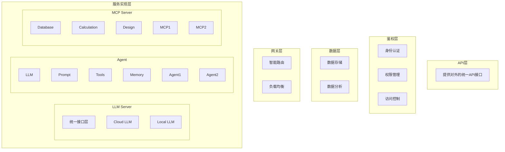

# TopMat-LLM 后端服务架构设计方案 v0.3

## 1. 系统架构

### 1.1 整体架构

系统采用分层架构设计，从上至下分为：API层、鉴权层、数据层、网关层和服务实现层。

### 1.2 层级职责

#### 1. API层
提供统一的对外接口，包括：
- RESTful API
- GraphQL API
- WebSocket 接口
- SDK 支持

#### 2. 鉴权层
负责系统安全和访问控制：
- 身份认证：JWT、OAuth2.0
- 权限管理：RBAC模型
- 访问控制：API级别的权限控制

#### 3. 数据层
处理数据存储和分析：
- 数据存储：结构化和非结构化数据管理
- 数据分析：数据统计和分析功能

#### 4. 网关层
负责请求路由和负载均衡：
- 智能路由：基于规则的请求分发
- 负载均衡：多实例间的负载分配

#### 5. 服务实现层
系统核心服务实现，分为三个主要服务：

